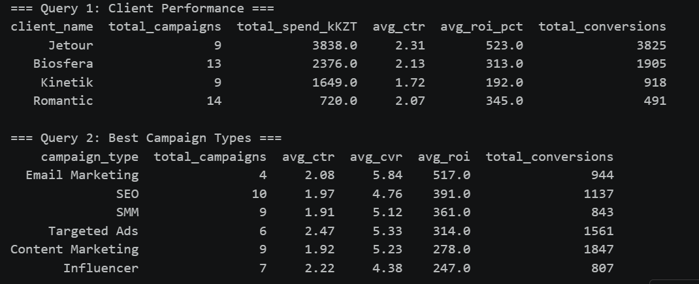
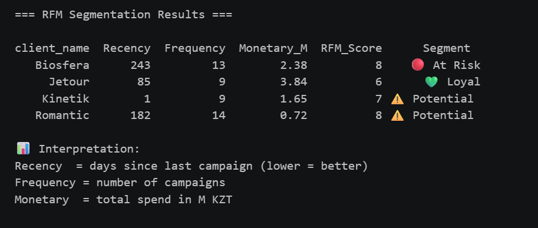
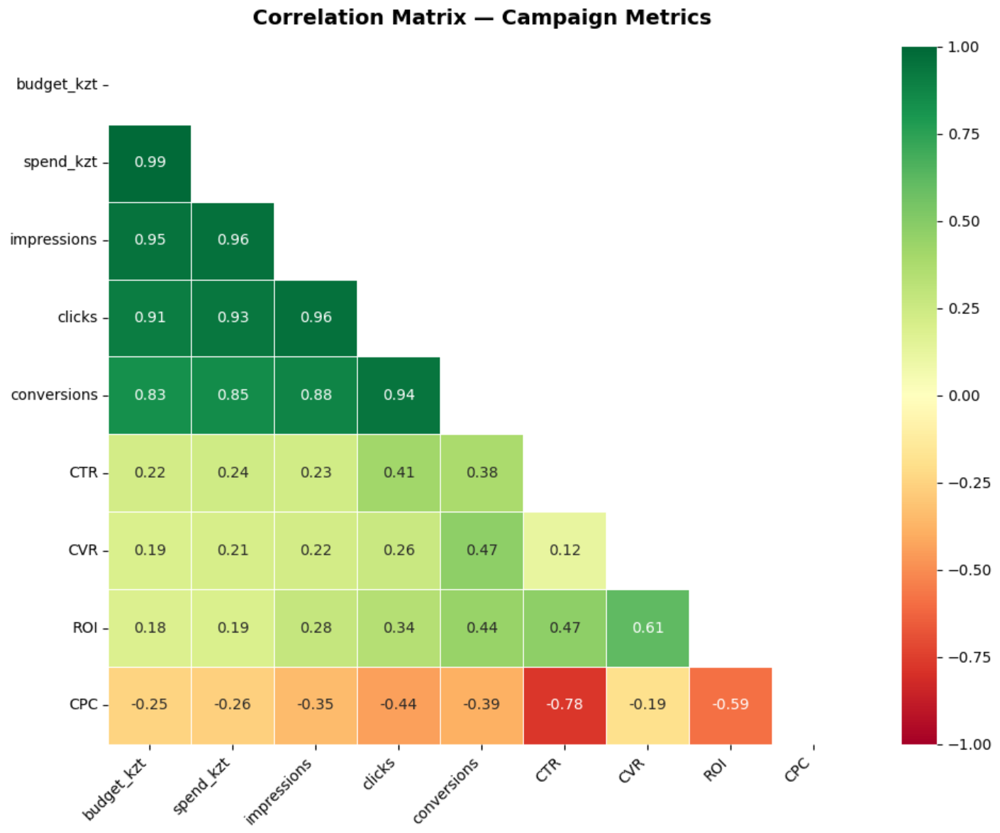
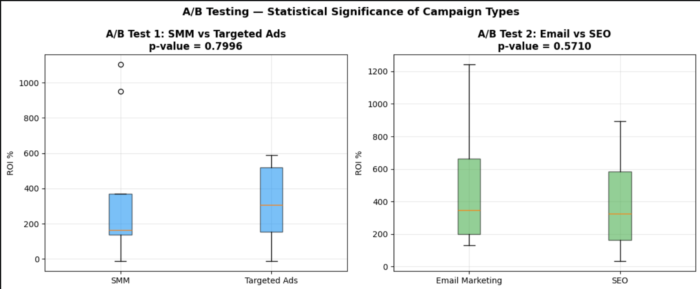
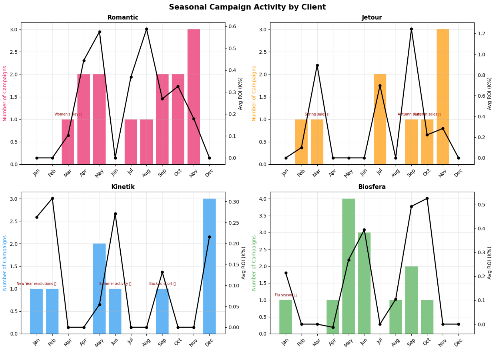
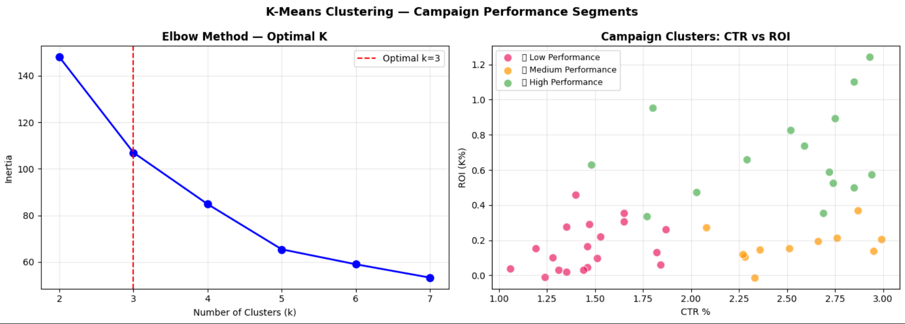
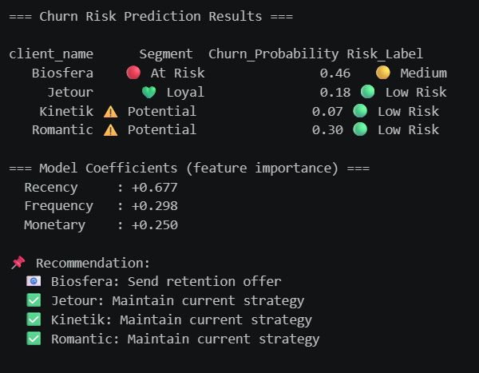
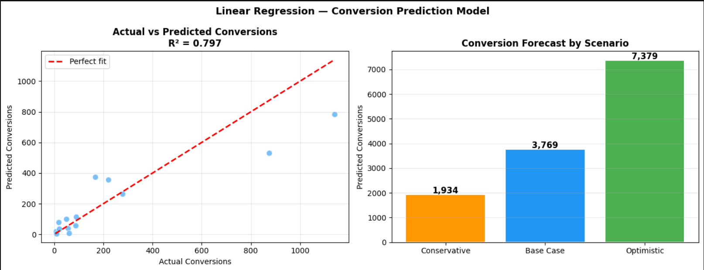
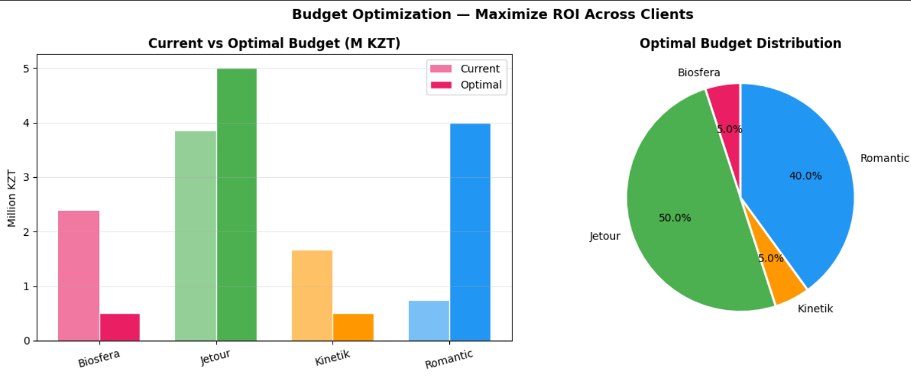

# Project Screenshots

Visual results from the WELON AGENCY analytics project — notebook outputs from the analysis pipeline.

## 1. SQL query results

## 2. RFM segmentation

## 3. Correlation heatmap

## 4. A/B testing boxplots

## 5. Seasonal analysis

## 6. K-Means clusters

## 7. Churn prediction

## 8. Conversion forecast

## 9. Budget optimization

